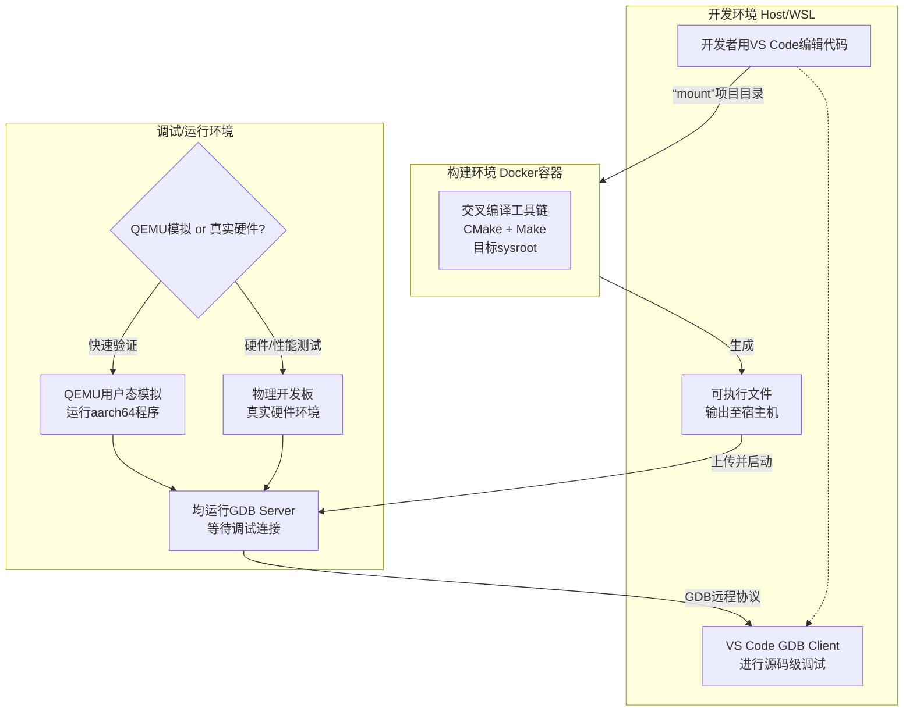

## Getting Started

本仓库提供一套 **基于 Docker 的 aarch64(RK3588) 交叉编译 + VSCode 远程调试** 模板：

- **构建环境**：Docker 镜像内包含交叉工具链 + sysroot + CMake/Make
- **开发环境**：宿主机/WSL2 上编辑代码、跑 clangd、查看产物
- **调试环境**：支持 **Docker/QEMU**（快速验证）与 **真机设备**（真实环境）两种模式

### Prerequisites

- **Host/WSL2**：Linux 或 WSL2（推荐 WSL2 + Docker Desktop 的 WSL backend）
  - 参考：[Install WSL](https://learn.microsoft.com/en-us/windows/wsl/install)
- **Docker**：能正常 `docker info`
  - 参考：[Docker Desktop WSL 2 backend](https://docs.docker.com/desktop/features/wsl/)
  - 参考：[Install Docker Engine](https://docs.docker.com/engine/install/)
- **VSCode（可选）**：安装 C/C++ 插件（调试），clangd（代码静态分析）
  - 参考：[VS Code](https://code.visualstudio.com/)
  - 参考：[C/C++ extension for VS Code](https://marketplace.visualstudio.com/items?itemName=ms-vscode.cpptools)
  - 参考：[clangd](https://clangd.llvm.org/)
- **gdb-multiarch（可选）**：宿主机调试 aarch64 时建议安装

```bash
sudo apt update && sudo apt install -y gdb-multiarch
```

- **说明**：Docker/QEMU 调试依赖容器内的 `qemu-user`；构建依赖容器内的 `cmake`/`make`（本仓库 `scripts/Dockerfile` 已包含）。
  - 参考：[QEMU](https://www.qemu.org/)
  - 参考：[CMake](https://cmake.org/)

### Quick Start（推荐按顺序执行）

1) 构建镜像（或使用团队提供的现成镜像）：

```bash
docker build -f ./scripts/Dockerfile -t rk3588-cross-env:v1.0 .
```

2) 初始化环境（写入环境变量到 `~/.bashrc` 并同步头文件用于 clangd）：

```bash
./build.sh setup-env
source ~/.bashrc
```

3) 执行 Debug 编译（在容器内跑 cmake+make，产物落到宿主机目录）：

```bash
./build.sh debug
```

> 提示：`./build.sh debug/release` 会生成 `compile_commands.json`，并在项目根目录创建软链接，供 clangd 使用。

常用命令速查：

```bash
./build.sh setup-env     # 初始化环境变量 + 同步头文件（clangd）
./build.sh clean         # 清理构建目录（HOST_BUILD_DIR_NAME）
./build.sh debug         # Debug 编译
./build.sh release       # Release 编译
./build.sh debug-start --dest docker  --target <binary_name>   # Docker/QEMU 启动 gdbstub
./build.sh debug-start --dest device --target <binary_name>   # 真机启动 gdbserver
./build.sh debug-logs  --dest docker|device                    # 跟随日志
./build.sh debug-stop  --dest docker|device                    # 停止调试环境
```

## STEP 1 使用 Dockerfile 构建交叉编译镜像

使用下面指令构建名为 `rk3588-cross-env:v1.0` 的 Docker 镜像：

```bash
docker build -f  ./scripts/Dockerfile -t rk3588-cross-env:v1.0 .
```

如下载基础镜像失败，可先拉取基础镜像再重试（本仓库 Dockerfile 默认基于 `ubuntu:24.04`）：

```bash
docker pull ubuntu:24.04
```

## STEP 2 配置 `.env` 并初始化环境

修改 `.env` 文件：

- **CONTAINER_IMAGE_NAME**：交叉编译镜像名（与上一步 build 的 tag 一致）
- **HOST_TOOLCHAIN_FILE**：工具链文件路径（默认：`cmake/toolchains/toolchain-container.cmake`）
- **HOST_BUILD_DIR_NAME**：构建目录（默认：`build-aarch64`）

然后执行初始化（会写入 `~/.bashrc`，并从镜像同步 sysroot/标准库头文件到项目内用于 clangd）：

```bash
./build.sh setup-env
source ~/.bashrc
```

> 如果使用 VSCode：建议 **重启 VSCode** 让环境变量与 `compile_commands.json` 索引生效。

## STEP 3 执行交叉编译

使用下面命令启动临时 Docker 容器并执行交叉编译：

```bash
./build.sh debug
```

你也可以构建 Release：

```bash
./build.sh release
```

## STEP 4 在 Docker/QEMU 中进行 Debug（快速验证）

方式 A：使用脚本启动 QEMU gdbstub（推荐，通用且可脱离 IDE）：

```bash
./build.sh debug-start --dest docker --target <binary_name>
```

然后在 VSCode 的 Debug 窗口选择 “Debug (Docker/QEMU)” 并输入同名可执行文件。

在 VSCode 的 Debug 窗口选择 "1. Debug (Docker/QEMU)"，在提示框输入需要 Debug 的可执行文件名，如"cross_test"，此时程序应当运行并停止在入口处。

调试期间查看/停止（Docker 模式）：

```bash
./build.sh debug-logs --dest docker
./build.sh debug-stop --dest docker
```

## STEP 5 (可选) 目标架构设备远程 Debug

修改 `.env` 文件中设备 IP 等，并为目标用户配置 SSH 免密登录（目标设备的 `~/.ssh/authorized_keys` 中增加用户公钥）。

在 VSCode 的 Debug 窗口选择 "2. Debug (Device)"，在提示框输入需要 Debug 的可执行文件名，如"cross_test"，此时程序应当运行并停止在入口处。

你也可以只用脚本完成启动/查看日志（Device 模式）：

```bash
./build.sh debug-start --dest device --target <binary_name>
./build.sh debug-logs  --dest device
./build.sh debug-stop  --dest device
```

## STEP 6（可选）移植交叉编译框架到其他 C++/CMake 项目

1. 如需交叉编译支持，请至少拷贝 `build.sh` `.env` `cmake/toolchains/toolchain-container.cmake` 到新的项目路径，如需 VSCode 远程 Debug 支持，还需要拷贝 `.vscode/launch.json` `.vscode/tasks.json` 

2. 修改`.env`中环境变量。

3. 为交叉编译环境 Docker 提供如下的环境变量：

```dockerfile
ENV SYSTEM_NAME=Linux
ENV SYSTEM_PROCESSOR=aarch64
ENV CC=${TOOLCHAIN_INSTALL_DIR}/bin/aarch64-none-linux-gnu-gcc
ENV CXX=${TOOLCHAIN_INSTALL_DIR}/bin/aarch64-none-linux-gnu-g++
ENV SYSROOT=${TOOLCHAIN_INSTALL_DIR}/aarch64-none-linux-gnu/libc

# --- 关键头文件路径定义 (用于通用 IDE 代码补齐静态分析支持和同步) ---
# 定义 C++ 标准库头文件路径
ENV TOOLCHAIN_CXX_INCLUDE=${TOOLCHAIN_INSTALL_DIR}/aarch64-none-linux-gnu/include/c++/10.2.1
# 定义 目标系统 C 头文件路径 (sysroot include)
ENV TOOLCHAIN_SYSROOT_INCLUDE=${TOOLCHAIN_INSTALL_DIR}/aarch64-none-linux-gnu/libc/usr/include
# 定义 GCC 内置头文件路径
ENV TOOLCHAIN_GCC_INCLUDE=${TOOLCHAIN_INSTALL_DIR}/lib/gcc/aarch64-none-linux-gnu/10.2.1/include
```

该方法已在 `Buildroot` 及 `Debian` 环境成功进行构建测试。

### `.env` 关键变量说明

- **CONTAINER_IMAGE_NAME**：交叉编译镜像名
- **HOST_TOOLCHAIN_FILE**：工具链文件路径（被 `build.sh` 传入 `-DCMAKE_TOOLCHAIN_FILE=...`）
- **HOST_BUILD_DIR_NAME**：构建目录（例如 `build-aarch64`）
- **DEVICE_IP/DEVICE_SSH_* / DEVICE_DEBUG_PORT**：真机调试相关配置

镜像内必须提供（见 `scripts/Dockerfile`）：

- `SYSTEM_NAME` / `SYSTEM_PROCESSOR`
- `CC` / `CXX`
- `SYSROOT`
- `TOOLCHAIN_CXX_INCLUDE` / `TOOLCHAIN_SYSROOT_INCLUDE`（用于 `setup-env` 同步头文件；可选 `TOOLCHAIN_GCC_INCLUDE`）


## 详细说明

本文旨在说明如何为团队提供基于Docker的统一**构建环境 (Build Environment)**（即交叉编译环境）

## 一、基本概念

### 1. **开发环境 (宿主机/WSL)**

- **开发者：** 使用他们熟悉的 IDE（例如 VS Code + C/C++ 插件）在宿主机上编辑、浏览、编写代码。
- **优势：** 充分利用宿主机的性能，IDE 的索引、代码补全、Git 操作速度快。

### 2. **构建环境 (Docker 容器)**

- **用途：** 仅用于执行构建过程，可通过脚本启动容器，将宿主机代码挂载进去，执行 `cmake` 和 `make` 命令。
- **优势：** **隔离性**保证了交叉编译工具链和 `sysroot` 的准确性；**可重复性**保证了团队成员构建出完全相同的二进制文件。
    
### 3. **调试环境 (远程连接)**

- **用途：** 容器/物理板可以同时作为远程调试服务器。
- 方法一：使用容器中的 QEMU 进行用户态模拟调试 ，QEMU 可以模拟目标架构（aarch64）的用户空间指令集。当在 x86_64 Linux 上运行 aarch64 程序时，QEMU 会实时翻译指令。
- 方法二：远程连接到实际硬件，对于涉及到硬件或性能测试的程序，最好的方法是连接到实际的目标设备。
- 方法：均通过 GDB Server 等待 GDB 连接进行远程 Debug。

    >由于宿主机需要安装运行`Docker`，如果使用`Windows`系统作为开发环境则依赖安装`WSL2`作为`Docker`后端，如宿主机不支持安装`WSL`,也可使用远程服务器或虚拟机作为宿主机的开发环境。

以下是本文介绍的三个环境协作示意


## 二、开发环境搭建步骤

本文介绍的开发环境：`VSCode` + `WSL2` + `Docker Desktop (WSL2 Docker engine)`。或是任何一台`Linux`系统计算机/虚拟机均可。

### 2.1 Docker 环境搭建

假设已经安装好`WSL2`及`Docker`。

可能有两种方式向开发团队提供交叉编译环境镜像：

1. 提供 `Dockerfile`，所有依赖需要联网下载并构建为镜像，使用指令
		`docker build -t rk3588-cross-env:v1.0 .`
	执行成功后即构建名为`rk3588-cross-env:v1.0`的镜像，并已经自动导入到Docker环境中，使用指令查看镜像：
		`docker images`

2. 直接提供镜像压缩包，直接导入镜像即可：
		`docker load -i rk3588-cross-env:v1.0.tar`
		
### 2.2  Host 环境搭建

由于本机也需要运行目标架构的 `gdb` 进行调试，如目标版本的`gdb`无法安装，可以安装`gdb-multiarch`以兼容所有架构。

## 三、构建步骤

原理：将本地项目目录 挂载（Mount） 到 Docker 容器内部，然后在容器内部执行 `CMake` 和编译命令。

| **元素**        | **位置**    | **作用**                        |
| ------------- | --------- | ----------------------------- |
| **项目代码**      | 宿主机       | 包含源代码，`CMakeLists.txt` 等。     |
| **Docker 容器** | 容器内部      | 包含交叉编译器、`sysroot` 和 CMake 工具。 |
| **Volume 挂载** | Docker 命令 | 将宿主机的目录实时映射到容器内部的目录，实现“加载”代码。 |
| **编译产物**      | 宿主机       | 编译成功后，可执行文件或库文件直接出现在宿主机上。     |


## 四、远程调试步骤

基本原理：依赖远程环境提供的 `GDB Server` 通信接口进行远程调试。

可通过以下两种方式进行代码调试：
1. QEMU 远程调试，主要用于快速验证代码逻辑，由于`QEMU`不能完全模拟硬件环境，因此并不支持调用摄像头、串口等与硬件或驱动的直接交互，但推荐使用 `QEMU`运行单元测试，初步验证开发功能。
2. 目标板远程调试，用于真实运行环境调试。

开启远程调试包含两个过程：
- 步骤一：上传可执行文件到容器内或目标板中，并使用远程环境的`GDB Server`运行可执行文件；
- 步骤二：使用 IDE，如`VSCode`，作为`GDB Client`连接远程接口，即可使用 IDE 进行远程调试。

步骤一由于不依赖具体的 IDE，因此可使用 bash 脚本进行控制，以此获得更好的通用性。由于需要 IDE 作为`GDB Client`，因此步骤二根据不同的 IDE 需要不同的配置方法，本文仅提供`VSCode`的配置说明。

### 步骤一：脚本控制上传可执行文件，启动`GDB Server`

设计思路：通过设置目标可执行文件名到脚本，自动完成上传并启动`GDB Server`。

### 步骤二：通过`VSCode` 启动 `GDB Client`

设计思路：通过设置目标可执行文件名到`VSCode`，启动调试。
 
`VSCode`支持**输入变量**的方式，来解决指定目标可执行文件的问题，其语法为 `${input:variableID}`，`variableID `指的是 `launch.json` 和 `tasks.json` 中`inputs`部分的 section。

目前，VS Code 支持三种类型的输入变量：
1. `promptString`：显示一个输入框，以便从用户处获取字符串。
2. `pickString`：显示一个快速选择下拉列表，让用户从多个选项中进行选择。
3. `command`：运行任意命令。

这里为了快速实现，我们选择`promptString`作为输入，及用户直接输入需要上传的可执行文件名即可。
> TODO：提供pickString列表选择可传输目标

## 五、常见问题

### Q0：运行 `./build.sh debug` 报错 “Could not find toolchain file …toolchain-container.cmake”

- **原因**：`.env` 的 `HOST_TOOLCHAIN_FILE` 指向了不存在的路径，或项目中缺少 `cmake/toolchains/toolchain-container.cmake`。
- **解决**：
  - 确认仓库内存在 `cmake/toolchains/toolchain-container.cmake`
  - 确认 `.env` 中 `HOST_TOOLCHAIN_FILE=cmake/toolchains/toolchain-container.cmake`

### Q0.1：CMake 报错 “CMake was unable to find a build program … CMAKE_MAKE_PROGRAM is not set”

- **原因**：容器内没有安装 make（或 CMake 生成器不匹配）。
- **解决**：确保镜像安装了 `build-essential`（本仓库 `scripts/Dockerfile` 已包含）。

### Q0.2：CMake 报错 “CMAKE_C_COMPILER not set / CMAKE_CXX_COMPILER not set”

- **原因**：容器里未设置 `CC/CXX` 环境变量，或工具链未安装/路径不对。
- **解决**：
  - 使用 `scripts/Dockerfile` 构建的镜像会设置 `CC/CXX`
  - 若你用自定义镜像，确保提供 `CC/CXX/SYSROOT/SYSTEM_*` 等变量

Q1: 无法运行交叉编译的可执行文件，出现类似报错 `/lib/aarch64-linux-gnu/libc.so.6: version `GLIBC_2.33' not found`。

A1: 由于交叉编译环境的 `sysroot` 版本不对，目标板执行
	`ldd --version`
可查看`glibc`版本。并使用在容器中检查检查交叉编译环境版本：
	`$ docker run --rm rk3588-cross-env:v1.0 ls -l "/opt/rk3588/toolchain/aarch64-none-linux-gnu/libc/lib64/"`
检查两则是否匹配。

## 六、附录

### 6.1 `VScode Tasks` 

[Tasks Schema](https://code.visualstudio.com/docs/reference/tasks-appendix)

VSCode自动关闭 task terminal 的逻辑：所有进程运行结束（即使是background进程）
